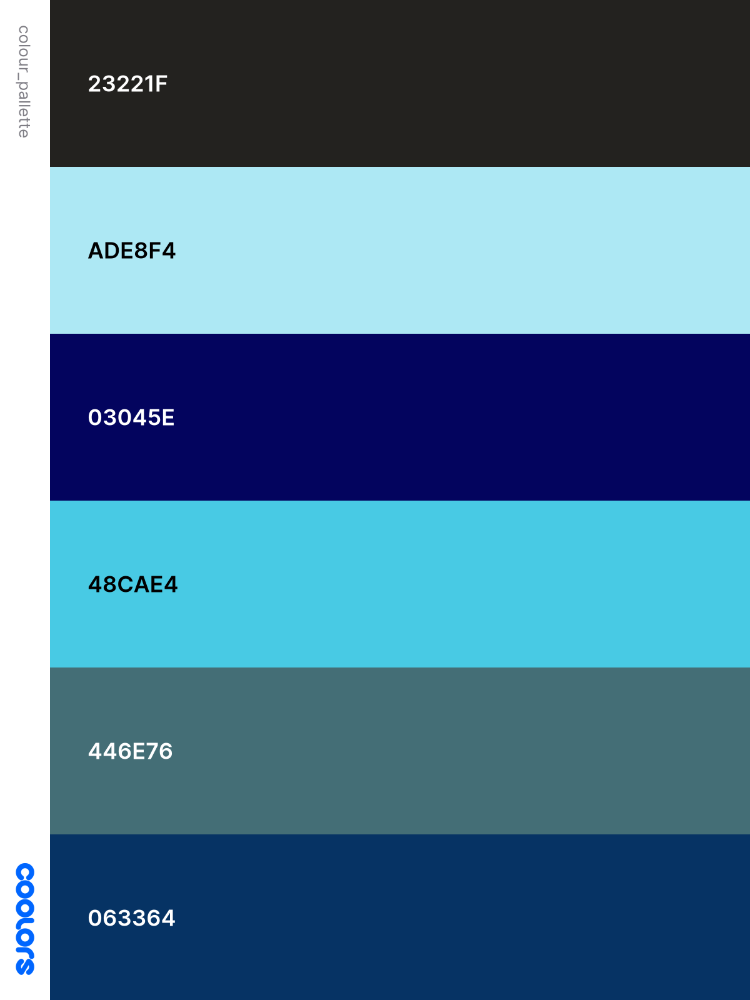

<h1 align="center">☀️ Weather Web App ❄️</h1>

☀️❄️☁️🌦️💧🌤️⚡

---

Welcome to the readme for the ‘Weather Web App', a collaborative project for the 1st Hackathon at the end of the JavaScript module for the Code Institutes Full Stack Software Developer Bootcamp.  
‘Weather Web App' is a responsive and accessible web application that provides users with real-time weather information, air quality updates, and a rain radar map. 

 

---

 
The live project can be found here: <a target="_blank" href="..."><em>..<em></a>

 

---

## ☀️ Creators

**Abduaziz Ahmed**   
**Elizabeth Kennard**  
**Fatima Mewouo**

---

## ☀️ Contents

[Introduction](#introduction) 
[Brief](#brief) 
[User Stories](#user-stories) 
[Project Planning](#project-planning) 
[Features](#features) 
[Navigation](#navigation) 
[Main content](#main-content) 
[AI Utilisation](#ai-utilisation) 
[Deployment](#deployment) 
[Technologies Used](#️technologies-used) 
[Testing and Debugging](#testing-and-debugging) 
[Validation](#validation) 
[Future Enhancements](#️future-enhancements) 
[Resources, Credits and Acknowledgements](#resources,-credits-and-acknowledgements) 

---

## ☀️ Introduction

‘Weather Web App' is a responsive and accessible web application that provides users with real-time weather information, air quality updates, and a rain radar map.

---

## ☀️ Brief

The Code Institutes learning objectives for this project were as follows:

☁️ O1: Learners will be able to design and implement a one-page interactive Front-End web application using HTML, CSS, and JavaScript focusing on user experience design, accessibility, and responsive DOM manipulation. 
 
☁️ O2: Learners will be able to test and validate a one-page web application through development, implementation, and deployment stages. 
 
☁️ O3: Learners will be able to deploy a one-page web application to a Cloud platform ensuring functionality and security. 
 
☁️ O4: Learners will be able to maximize future maintainability through thorough documentation, clear code structure, and organization. 
 
☁️ O5: Learners will be able to implement and document front-end interactivity using core JavaScript, JavaScript libraries, or frameworks with a focus on DOM manipulation for a one-page web application. 
 
☁️ O6: Learners will be able to leverage AI tools to orchestrate the software development process.

---

## ☀️ User Stories

 ### ❄️ Must haves
 ☁️ As a user, I want to view the current weather for my location, so I can decide what to wear or whether to bring an umbrella. 
 ☁️ As a planner, I want to view a 7-day weather forecast, so I can view a 7-day weather forecast 
 ☁️ As a user, I want to search for weather in different cities, so I can check conditions for places I plan to travel. 
☁️ As a mobile user, I want the weather page to adjust neatly to my screen size, so I can easily use it on the go. 
☁️ As a visually impaired user, I want to navigate the site using screen readers and keyboard shortcuts, so the experience is inclusive. 

 ### ❄️ Should Haves
 ☁️ As a commuter, I want to see a live rain radar map, so I can plan my walk or drive accordingly. 
 ☁️ As a curious user, I want to toggle between Celsius and Fahrenheit, so I can view temperatures in my preferred format. 
☁️ As a weather enthusiast, I want to see animated transitions (like clouds or droplets) based on live conditions, so the site feels dynamic and engaging. 

 ### ❄️ Could Haves
☁️ As a user, I want to receive an alert when air quality reaches a poor level, so I can take precautions. 
☁️ As a health-conscious user, I want to see the local air quality index (AQI) with colour-coded warnings, so I can avoid going outside during unsafe conditions. 

---

## ☀️ Project Planning

### ❄️ API selction

### ❄️ Wireframes

Landing Page Wireframe

 

Main Page Wireframe

### ❄️ Colour Palette

### ❄️ Font Typography

---

## ☀️ Features

☁️ Live weather and 7-day forecast; 
☁️ City search functionality; 
☁️ Mobile-first, fully responsive layout 
☁️ Accessible with keyboard and screen reader support 

---

## ☀️ Navigation

navbar or button etc

---

## ☀️ Main content

----

## ☀️ AI Utilisation

user stories
debugging
etc

---

## ☀️ Deployment

early deploymnet?

---

## ☀️ Technologies Used

HTML5, CSS3, JavaScript (ES6)
 
Git & GitHub for version control

---

## ☀️ Testing and Debugging

stuff and things

---

## ☀️ Validation

### ❄️ HTML

### ❄️ CSS 

### ❄️ JavaScript

---

## ☀️ Future Enhancements

☁️ User preferences stored in local storage 
☁️ Dynamic animations for weather types 

---

## ☀️ Resources, Credits and Acknowledgements

Thanks to [API providers], our instructors, and the open-source community for tools and guidance!

---